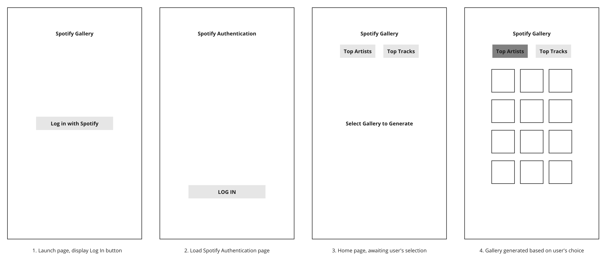

# Spotify Gallery App

The Spotify Gallery App is a web application that allows users to discover their top tracks and artists from their Spotify account. The app provides a user-friendly interface for visualizing and exploring their music preferences.

## Table of Contents

- [Introduction](#introduction)
- [Features](#features)
- [Technologies Used](#technologies-used)
- [Wireframes](#wireframes)
- [User Stories](#user-stories)
- [Planning and Development Process](#planning-and-development-process)

## Introduction
With the Spotify API, the idea is to generate a user’s “Spotify Gallery”, by accessing Spotify Artist thumbnails, Album and Song cover art images to show monthly top artist, songs, and albums.

Inspired by tumblr blogroll pages, blogrolls show a list of people you’re following. It visually “rolls out” the profile images of the users you follow. 

## Features

- Authenticate users with Spotify to access their top tracks and artists.
- Display user's profile display name and current date/time.
- Allow users to switch between viewing top tracks and top artists.
- Provide options to view top tracks and artists for different time ranges (last month, all time).
- Generate a customized gallery layout with album covers and artist images.
- Enable users to download a screenshot of their gallery.

## Technologies Used

- React: JavaScript library for building user interfaces.
- Axios: Promise-based HTTP client for making API requests.
- Moment.js: Library for working with dates and times.
- dom-to-image: Library for capturing and downloading screenshots.
- Spotify Web API: Used to retrieve user data, top tracks, and artists.
- CSS: Stylesheets for designing the app's user interface.

## Wireframes

**App Flow Visualisation**

**Low-Res Prototype**

**Additional Features Added:**

- Last Month & All Time toggle using radio buttons
- Save Image and Log Out buttons

## User Stories

**The User is able to:**

- **View their Spotify Top Tracks and Artists Gallery:** Upon logging in with their Spotify account, users can access a gallery generated based on their top tracks and artists.

- **Switch Between Top Tracks and Top Artists:** Users have the ability to toggle between viewing their top tracks and top artists, allowing them to explore their musical preferences for both categories.

- **Select Time Ranges:** Users can choose between different time ranges to see how their music preferences change. They have the option to view their top tracks and artists for the last month or all time.

- **Capture and Download Screenshots:** The app offers a feature to capture a screenshot of the personalised gallery layout. Users can download this screenshot to keep a record of their top tracks and artists.

- **Log Out Securely:** Users can log out of the app whenever they're done exploring. This ensures the security and privacy of their Spotify data and personal information.

## Planning and Development Process

### Task Flow

- Authentication and Login with Spotify
- Routes (pages)
- Call API with Axios
- Render data frontend
- App styling

### Unsolved Problems

- **Users without access cannot use the app:** Due to the API regulations, only Spotify users with given access can use the app in development mode. Not really an unsolved problem, more of a limitation.

- **Screenshot feature not compatible on mobile browsers:** The save image feature is not fully functional on mobile browsers.